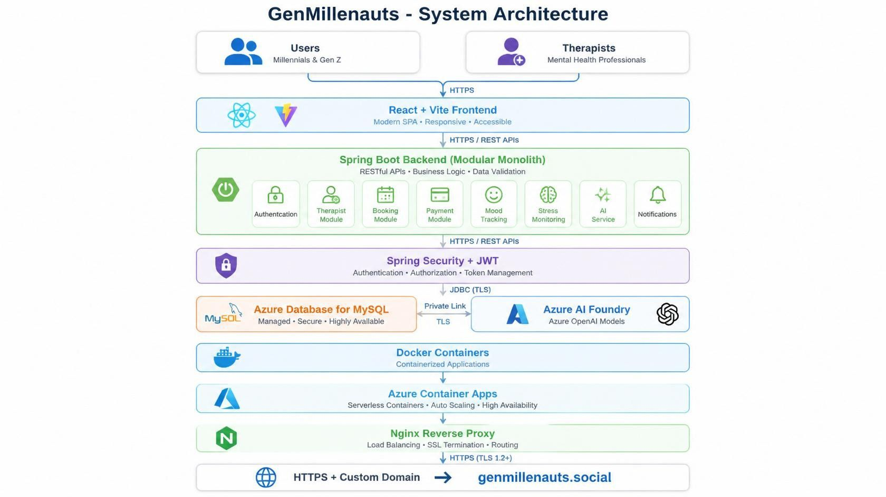
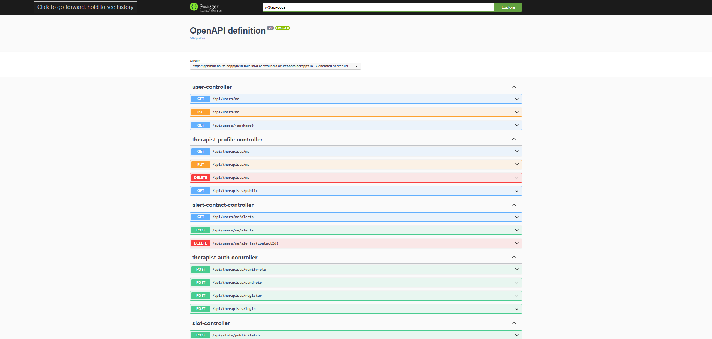
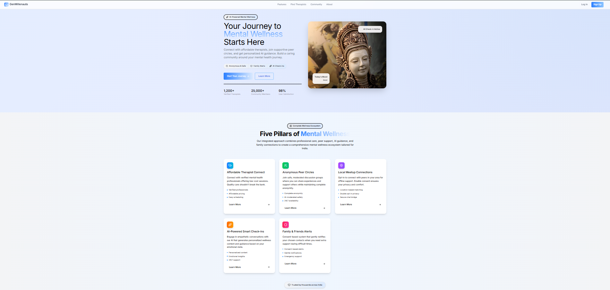
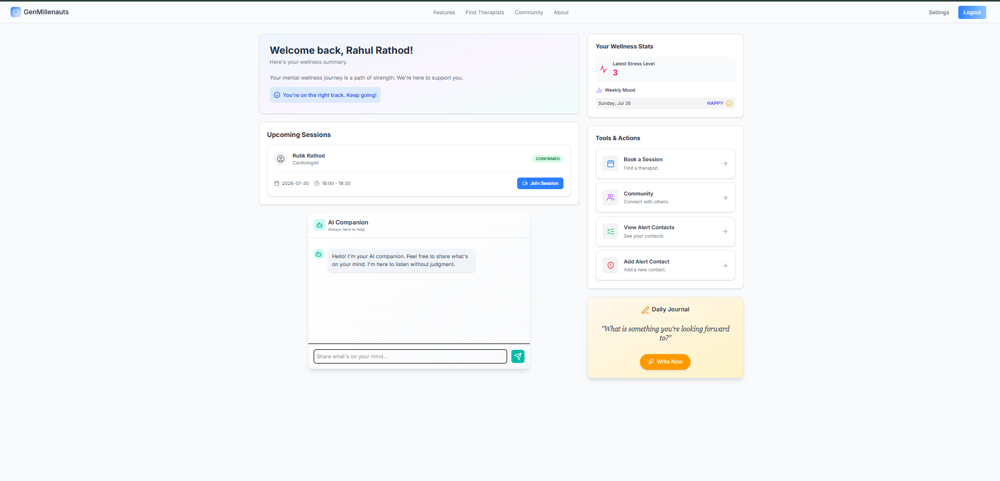
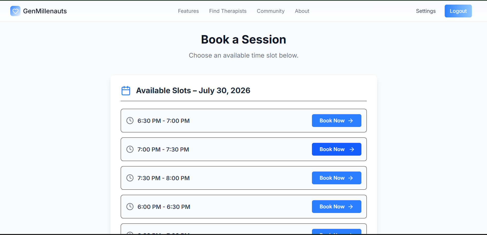

# GenMillenauts

GenMillenauts is an AI-enabled mental wellness platform focused on therapist discovery, appointment workflows, mood tracking, and conversational support.

This repository contains the Spring Boot backend API and deployment assets.

## Live Links

- Application: https://genmillenauts.social
- Swagger UI: https://genmillenauts.happyfield-fc9e256d.centralindia.azurecontainerapps.io/swagger-ui/index.html
- OpenAPI JSON: https://genmillenauts.happyfield-fc9e256d.centralindia.azurecontainerapps.io/v3/api-docs

## Key Capabilities

- JWT-based authentication and authorization
- User and therapist profile management
- Slot management and appointment booking
- Mood and stress logging
- AI-assisted chat and stress support
- OpenAPI-documented REST endpoints

## Technology Stack

- **Language & Runtime:** Java 21
- **Framework:** Spring Boot 3
- **Security:** Spring Security, JWT
- **Data:** Spring Data JPA, MySQL
- **AI Integrations:** Azure AI Foundry, OpenAI, Gemini
- **Messaging/Notifications:** Twilio, Spring Mail, RabbitMQ
- **API Documentation:** springdoc OpenAPI (Swagger UI)
- **DevOps/Cloud:** Docker, Azure Container Apps, Azure Database for MySQL

## Architecture

### System Architecture



### Azure Deployment Architecture


## Project Structure

```text
genMillenauts/
├── src/
│   ├── main/
│   │   ├── java/com/rahul/genmillenauts/
│   │   └── resources/
│   └── test/
├── docs/
├── screenshots/
├── Dockerfile
├── docker-compose.yml
├── pom.xml
└── README.md
```

## Getting Started

### Prerequisites

- Java 21
- Maven 3.9+ (or use `./mvnw`)
- MySQL

### Clone and Run

```bash
git clone https://github.com/ratrahu007/genMillenauts.git
cd genMillenauts
./mvnw clean install
./mvnw spring-boot:run
```

The API will be available at:

- `http://localhost:8080`
- `http://localhost:8080/swagger-ui/index.html`

## Configuration

The application is configured through environment variables in `src/main/resources/application.properties`.

Common required variables include:

- `SPRING_DATASOURCE_URL`
- `SPRING_DATASOURCE_USERNAME`
- `SPRING_DATASOURCE_PASSWORD`
- `JWT_SECRET`
- `JWT_EXPIRATION`
- `AI_AZURE_ENDPOINT`
- `AI_AZURE_API_KEY`
- `AI_AZURE_DEPLOYMENT`

## API Preview



## Product Screenshots

| Home | User Dashboard |
|---|---|
|  |  |

| Therapist Dashboard | Slot Booking |
|---|---|
|  |  |

| AI Chat |
|---|
|  |

## Roadmap

- Google OAuth
- Payment gateway integration
- Email notifications
- Admin analytics
- AI mood prediction
- Mobile application

## Author

**Rahul Rathod**  
Java Full Stack Developer

- GitHub: https://github.com/ratrahu007
- LinkedIn: https://www.linkedin.com/in/rahul-rathod-4742982a6

---

If you find this project useful, consider starring the repository.
